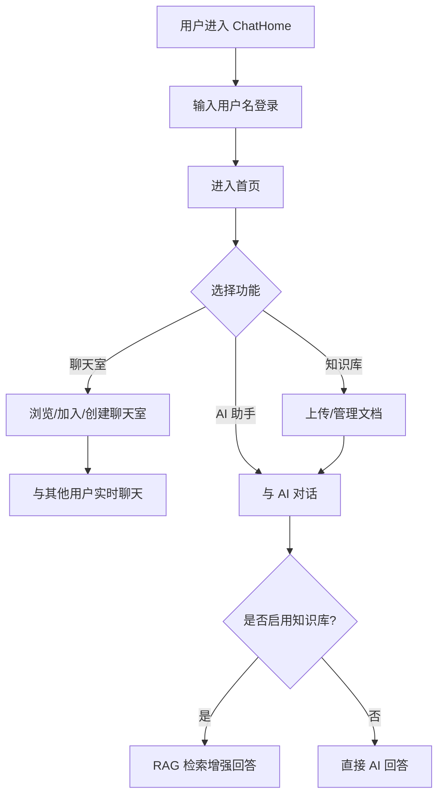

## 1. 产品概述

ChatHome 是一款集即时通讯与 AI 智能助手于一体的聊天室软件。用户可以创建或加入聊天室进行实时群聊，也可以与 AI 助手对话、上传文档让 AI 基于知识库进行 RAG 检索增强回答，实现高效的知识学习与智能问答。

- 核心定位：面向学习者和团队协作者的智能聊天平台
- 目标用户：学生、知识工作者、小型团队

## 2. 核心功能

### 2.1 用户角色

| 角色 | 注册方式 | 核心权限 |
|------|----------|----------|
| 普通用户 | 用户名注册 | 聊天、AI 问答、知识库管理 |

### 2.2 功能模块

1. **首页/聊天室列表**：展示用户加入的聊天室，支持创建和加入聊天室
2. **聊天室页面**：用户间实时群聊，支持文字消息
3. **AI 助手页面**：与 AI 对话，支持普通问答和基于知识库的 RAG 检索
4. **知识库管理**：上传文档，管理知识库内容

### 2.3 页面详情

| 页面名称 | 模块名称 | 功能描述 |
|----------|----------|----------|
| 登录页 | 登录表单 | 用户名输入，进入聊天系统 |
| 首页 | 侧边导航栏 | 聊天室列表、AI 助手、知识库入口切换 |
| 首页 | 聊天室列表 | 展示已加入的聊天室，显示最近消息预览 |
| 首页 | 创建/加入聊天室 | 创建新聊天室或通过名称加入已有聊天室 |
| 聊天室 | 消息列表 | 实时显示聊天消息，自动滚动到最新 |
| 聊天室 | 消息输入框 | 发送文字消息，Enter 快捷发送 |
| 聊天室 | 在线用户列表 | 显示当前聊天室在线成员 |
| AI 助手 | 对话列表 | 与 AI 的多轮对话历史 |
| AI 助手 | 消息输入 | 发送问题，AI 流式返回答案 |
| AI 助手 | 知识库选择 | 选择已上传的知识库文档，启用 RAG 模式 |
| 知识库 | 文档上传 | 上传 txt、pdf、md 文件到知识库 |
| 知识库 | 文档列表 | 展示已上传文档，支持删除 |

## 3. 核心流程

## 4. 用户界面设计

### 4.1 设计风格

- **主题**：深色科技风（Dark Tech），营造专业、现代的 AI 聊天氛围
- **主色调**：深蓝黑底 `#0f1729`，霓虹青 `#00f0ff` 作为强调色
- **辅色**：紫色渐变 `#7c3aed → #a855f7`，温暖琥珀 `#f59e0b` 用于通知
- **字体**：标题使用 `Orbitron`（科技感无衬线），正文使用 `JetBrains Mono`（等宽字体，代码/聊天场景自然）
- **按钮**：圆角矩形，带发光边框效果（neon glow border）
- **布局**：左侧窄导航栏（图标）+ 中间主内容区 + 右侧信息面板（三栏布局）
- **动画**：消息淡入、打字指示器闪烁、输入框聚焦光晕

### 4.2 页面设计概览

| 页面名称 | 模块名称 | UI 元素 |
|----------|----------|---------|
| 登录页 | 登录表单 | 居中卡片，霓虹边框，标题科技字体，输入框带发光聚焦效果 |
| 首页 | 侧边导航 | 64px 宽深色竖栏，图标按钮，当前激活态霓虹青色发光 |
| 首页 | 聊天室列表 | 卡片列表，每项显示名称和最新消息预览，悬停边框发光 |
| 聊天室 | 消息区域 | 消息气泡，自己消息右侧青色边框，他人消息左侧紫色边框 |
| 聊天室 | 输入区域 | 底部固定输入栏，霓虹聚焦光晕，圆角，发送按钮带图标 |
| AI 助手 | 对话区 | AI 回复使用 Markdown 渲染，代码块高亮，流式打字动画 |
| 知识库 | 上传区 | 拖拽上传区域，虚线边框，悬停变色，文件列表带进度指示 |

### 4.3 响应式

- 桌面优先设计（1440px 基准）
- 平板（768px-1024px）：收起右侧面板，保留左侧图标栏和主内容
- 手机（<768px）：底部 Tab 导航替代侧边栏，单栏布局

## 5. 非功能需求

- 实时消息延迟 < 200ms
- AI 响应支持流式输出（SSE）
- RAG 检索准确率 > 80%
- 支持同时 100+ 在线用户
- 聊天记录本地持久化