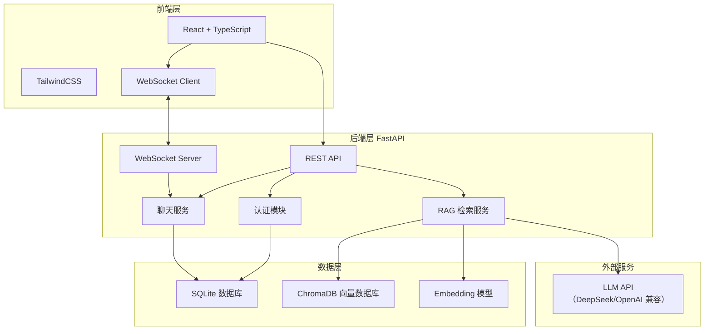
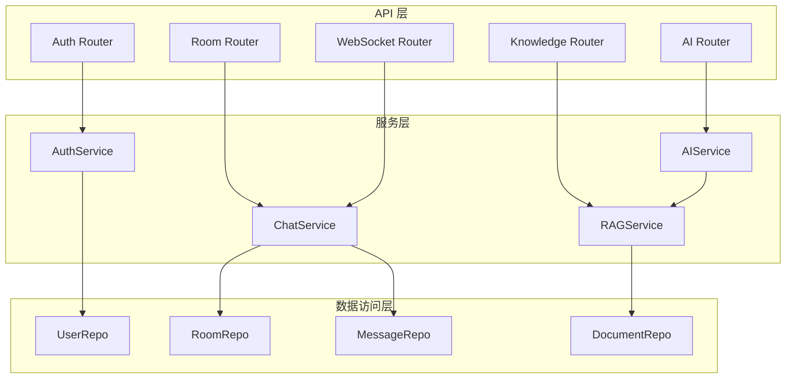
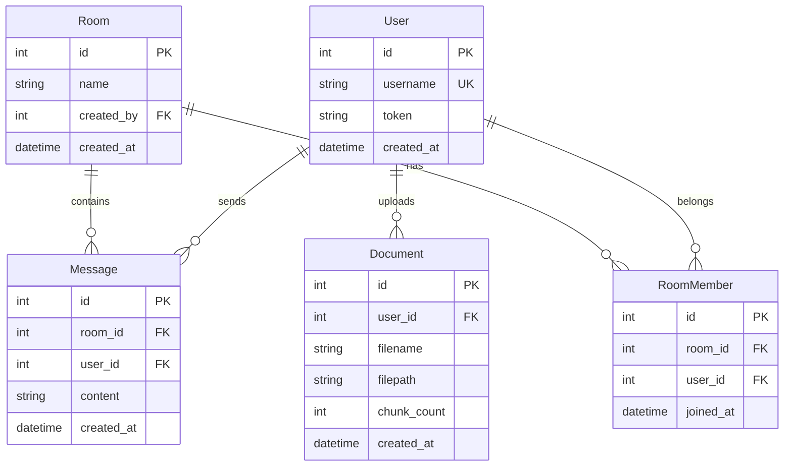

## 1. 架构设计



## 2. 技术选型

| 层级 | 技术 | 说明 |
|------|------|------|
| 前端框架 | React 18 + TypeScript | 组件化开发，类型安全 |
| 样式方案 | TailwindCSS 3 | 原子化 CSS，快速构建界面 |
| 构建工具 | Vite 5 | 极速 HMR 开发体验 |
| 后端框架 | Python FastAPI | 异步高性能，原生 WebSocket 支持 |
| 实时通信 | WebSocket | 聊天室消息实时推送 |
| ORM | SQLAlchemy + aiosqlite | 异步数据库操作 |
| 数据库 | SQLite | 轻量级，无需额外部署 |
| 向量数据库 | ChromaDB | 嵌入式向量存储，适合 RAG |
| Embedding | sentence-transformers | 本地文本向量化 |
| LLM | DeepSeek API（OpenAI 兼容） | 免费额度，中文能力强 |
| AI 框架 | LangChain | RAG 链路编排 |

## 3. 路由定义

| 路由 | 页面 | 说明 |
|------|------|------|
| `/login` | 登录页 | 用户名输入，进入系统 |
| `/` | 首页 | 聊天室列表 + 侧边导航 |
| `/chat/:roomId` | 聊天室 | 用户间群聊 |
| `/ai` | AI 助手 | 与 AI 对话 + RAG |
| `/knowledge` | 知识库 | 文档上传与管理 |

## 4. API 定义

### 4.1 REST API

```typescript
// 用户
POST   /api/auth/login        // { username: string } → { token: string, user: User }
GET    /api/auth/me           // → { user: User }

// 聊天室
GET    /api/rooms             // → { rooms: Room[] }
POST   /api/rooms             // { name: string } → { room: Room }
POST   /api/rooms/join        // { room_id: number } → { room: Room }
GET    /api/rooms/:id/messages // → { messages: Message[] }

// AI 对话
POST   /api/ai/chat           // { message: string, knowledge_ids?: number[] } → SSE Stream
GET    /api/ai/history        // → { conversations: Conversation[] }

// 知识库
POST   /api/knowledge/upload  // FormData { file: File } → { document: Document }
GET    /api/knowledge/documents // → { documents: Document[] }
DELETE /api/knowledge/:id     // → { success: boolean }
```

### 4.2 WebSocket 协议

```typescript
// 客户端 → 服务端
type ClientMessage =
  | { type: "join_room"; room_id: number; username: string }
  | { type: "leave_room"; room_id: number }
  | { type: "chat_message"; room_id: number; content: string }

// 服务端 → 客户端
type ServerMessage =
  | { type: "user_joined"; username: string; users: string[] }
  | { type: "user_left"; username: string; users: string[] }
  | { type: "new_message"; id: number; username: string; content: string; created_at: string }
  | { type: "error"; message: string }
```

## 5. 服务端架构



## 6. 数据模型

### 6.1 ER 图



### 6.2 DDL

```sql
CREATE TABLE users (
    id INTEGER PRIMARY KEY AUTOINCREMENT,
    username TEXT UNIQUE NOT NULL,
    token TEXT NOT NULL,
    created_at DATETIME DEFAULT CURRENT_TIMESTAMP
);

CREATE TABLE rooms (
    id INTEGER PRIMARY KEY AUTOINCREMENT,
    name TEXT NOT NULL,
    created_by INTEGER REFERENCES users(id),
    created_at DATETIME DEFAULT CURRENT_TIMESTAMP
);

CREATE TABLE messages (
    id INTEGER PRIMARY KEY AUTOINCREMENT,
    room_id INTEGER NOT NULL REFERENCES rooms(id),
    user_id INTEGER NOT NULL REFERENCES users(id),
    content TEXT NOT NULL,
    created_at DATETIME DEFAULT CURRENT_TIMESTAMP
);

CREATE TABLE room_members (
    id INTEGER PRIMARY KEY AUTOINCREMENT,
    room_id INTEGER NOT NULL REFERENCES rooms(id),
    user_id INTEGER NOT NULL REFERENCES users(id),
    joined_at DATETIME DEFAULT CURRENT_TIMESTAMP,
    UNIQUE(room_id, user_id)
);

CREATE TABLE documents (
    id INTEGER PRIMARY KEY AUTOINCREMENT,
    user_id INTEGER NOT NULL REFERENCES users(id),
    filename TEXT NOT NULL,
    filepath TEXT NOT NULL,
    chunk_count INTEGER DEFAULT 0,
    created_at DATETIME DEFAULT CURRENT_TIMESTAMP
);
```

## 7. 项目目录结构

```
ChatHome/
├── frontend/                    # React 前端
│   ├── src/
│   │   ├── components/          # 通用组件
│   │   ├── pages/               # 页面组件
│   │   ├── hooks/               # 自定义 Hooks
│   │   ├── services/            # API 调用
│   │   ├── store/               # 状态管理
│   │   ├── types/               # TypeScript 类型
│   │   ├── App.tsx
│   │   └── main.tsx
│   ├── index.html
│   ├── tailwind.config.js
│   ├── vite.config.ts
│   └── package.json
├── backend/                     # Python 后端
│   ├── app/
│   │   ├── api/                 # 路由层
│   │   ├── services/            # 业务服务
│   │   ├── models/              # 数据模型
│   │   ├── core/                # 核心配置
│   │   └── main.py
│   ├── data/                    # 数据文件（SQLite, ChromaDB）
│   ├── uploads/                 # 上传文档
│   ├── requirements.txt
│   └── .env
└── .trae/
    └── documents/
```